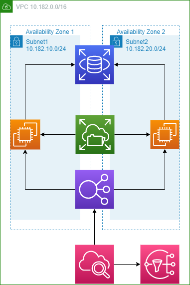

# HeleCloud task using Terraform
> Building EC2 instances, RDS MySQL DB, Application Load Balancer and monitoring current connections

# Contents

- compute
- networking
- RDS
- CloudWatch
- SNS
- interfaces

## Contents explained

 - **main** defines region and keys to be used by Terraform
 - **compute** defines EC2 instances with all of their properties, attaching network interface with static IP in different subnet in the same VPC, also post-configs needed by the EC2 instances and attaching of EFS share
 - **networking** defines creating of additional VPC with different CIDR block, 2 staging subnets inside the same VPC, definitions of the LoadBalancer and ingress and egress rules related to the SecurityGroups for the LB, EC2, EFS, etc.
 - **RDS** deploys a micro MySQL 8.0 RDS instance which is **not** publicly available but only reachable between CIDR blocks inside the VPC on port defined - 3306
 - **EFS** creates a new EFS share which is mounted on both EC2 instances deployed
 - **CloudWatch** is set to monitor RequestCount over a period of 1 minute and set to trigger an alarm if connections are more than 20 per minute, that alarm is related to the SNS topic
 - **SNS** creates a topic with subscription to an email recipient who will be notified if CloudWatch alert level is breached. Also sends email to the same recipient when alarm has been cleared.
 - **variables** defines some of the values used accross the code, some of them marked as sensitive and defined in tfvars file
 - **outputs** provides values after **terraform apply** was executed and finished with deployment of the infrastructure - i.e. public IP of the EC2 instances, DNS name of the MySQL RDS instance, public address of the ELB, etc.

# High-level design
